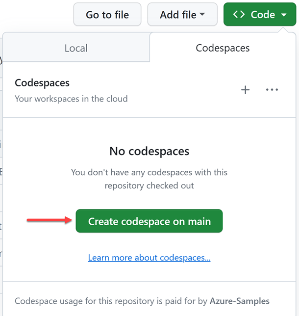

# 세션 00: 개발 환경 설정하기

이 세션에서는 워크샵 진행을 위해 필요한 개발 환경 설정을 진행합니다.

<!-- ## Azure OpenAI 프록시 구독 및 GitHub Copilot 구독 신청

1. 아래 링크를 클릭해서 Azure OpenAI 프록시 구독 및 GitHub Copilot 구독을 신청합니다.

   👉 구독 신청 링크: [https://aka.ms/aspireinadaykr/request](https://aka.ms/aspireinadaykr/request)

1. 신청한 이메일을 통해 `DoNotReply@aoai.kr` 발신자로 Azure OpenAI 프록시 구독 코드 및 GitHub Copilot 구독 코드가 온 것을 확인합니다.
1. 아래 링크를 통해 GitHub Copilot 구독을 마무리합니다.

   👉 GitHub Copilot 구독 신청 링크: [https://github.com/redeem](https://github.com/redeem) -->

<!--
1. 아래 링크를 통해 Azure OpenAI 프록시 코드가 제대로 작동하는지 확인합니다.

   👉 Azure OpenAI 프록시 플레이그라운드 링크: [https://proxy.aoai.kr/playground](https://proxy.aoai.kr/playground)
-->

## GitHub Codespaces 시작

1. 이 리포지토리를 자신의 GitHub 계정으로 포크합니다.
1. 포크한 리포지토리에서 GitHub Codespaces 인스턴스를 생성합니다.

    

## GitHub Codespaces 개발 환경 확인

1. 아래 명령어를 실행시켜 필요한 개발 도구가 설치되어 있는지 확인합니다.

    ```bash
    azd version
    az --version
    gh --version
    pac help
    dotnet --list-sdks
    ```

## 애저 Dev CLI 로그인

1. [애저 Dev CLI][azd cli]를 이용해서 애저에 로그인합니다. 아래 명령어를 입력하세요.

    ```bash
    azd auth login --use-device-code=false
    ```

1. 웹 브라우저의 새 탭이 열리면서 404 에러가 나타나면 주소창의 URL을 복사해서 아래와 같이 새 zsh 셸을 열고 붙여넣기 합니다.

    ```bash
    curl <복사한 URL>
    ```

1. 아래 명령어를 통해 로그인이 잘 되었는지 확인합니다.

    ```bash
    azd auth login --check-status
    ```

## 애저 CLI 로그인

1. [애저 CLI][az cli] 명령어를 통해 다시 애저에 로그인합니다. 아래 명령어를 입력하세요.

    ```bash
    az login
    ```

1. 웹 브라우저의 새 탭이 열리면서 404 에러가 나타나면 주소창의 URL을 복사해서 아래와 같이 새 zsh 셸을 열고 붙여넣기 합니다.

    ```bash
    curl <복사한 URL>
    ```

1. 로그인 후 현재 설정되어 있는 구독을 확인합니다.

    ```bash
    az account show
    ```

1. 만약 현재 설정된 구독과 다른 구독을 사용하고 싶다면 아래 명령어를 통해 현재 로그인한 계정에 물려있는 구독 리스트를 확인합니다.

    ```bash
    az account list --query "[].name" -o tsv
    ```

1. 위의 리스트에서 내가 원하는 구독 이름이 `azure-gppb` 이라고 가정합니다. 그러면 아래 명령어를 통해 내가 원하는 구독으로 설정합니다.

    ```bash
    az account set --subscription azure-gppb
    ```

1. 다시 아래 명령어를 통해 내가 원하는 구독으로 바뀌었는지 확인합니다.

    ```bash
    az account show
    ```

---

축하합니다! 개발 환경 설정이 끝났습니다. 이제 [Session 01: 백엔드 API 개발하기](./01-api-app.md)로 넘어가세요.

[azd cli]: https://learn.microsoft.com/ko-kr/azure/developer/azure-developer-cli/overview?WT.mc_id=dotnet-87051-juyoo
[az cli]: https://learn.microsoft.com/ko-kr/cli/azure/what-is-azure-cli?WT.mc_id=dotnet-87051-juyoo
